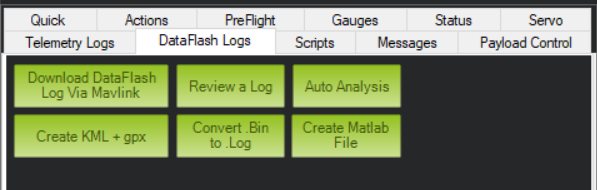

## Matlab Import for Ardupilot

This is a collection of scripts to import and analyze dataflash logs from Ardupilot in Matlab.

Matlab data can be created from dataflash logs in Mission Planner in the __Dataflash Logs__ tab under the Mission Planner HUD.

